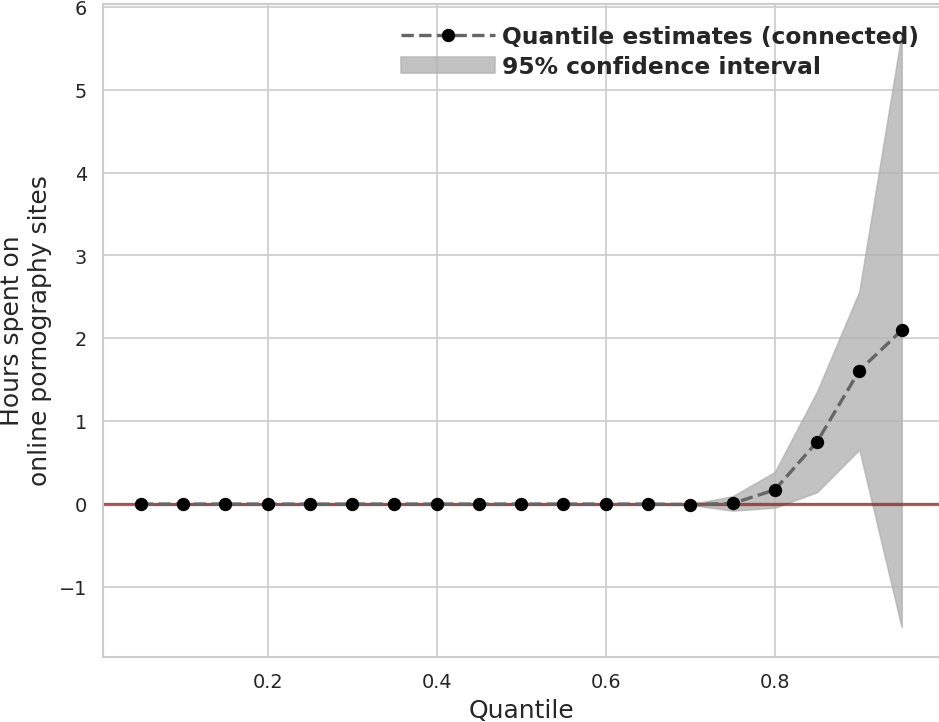
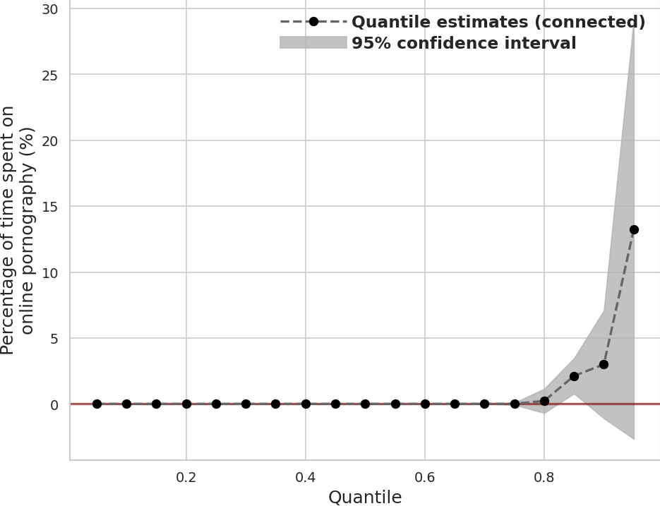

## Holier Than Thou: Partisan Gap in the Consumption of Pornography Online

Both the parties claim the moral higher ground. When it comes to pornography, elites of both parties condemn it--- one's case for morality is steeped in religion, another's in enduring concern for women. We test whether Republicans consume more pornography than Democrats. Using passively collected domain level web visitation data from 1200 respondents over June, 2022, we find that the consumption of pornography online is very concentrated with a few respondents consuming a lot of pornography and most consuming little. Our data rules out large partisan differences in consumption of pornography online.

### Key Results

**Distribution of Partisan Differences in Hours Spent on Pornographic Sites**

**Distribution of Partisan Differences in Percentage of Time Spent on Pornographic Sites**

### Replication Materials
* [Data](https://dataverse.harvard.edu/dataset.xhtml?persistentId=doi:10.7910/DVN/VIV4TS)
* [Scripts](scripts/)
* [Tables](tabs/)
* [Figures](figs/)
* [Manuscript](ms/)

### Note

We measure pornographic content on domains using [piedomains](https://github.com/themains/piedomains) (and the YouGov-provided classifications).

### Authors

Lucas Shen and Gaurav Sood
