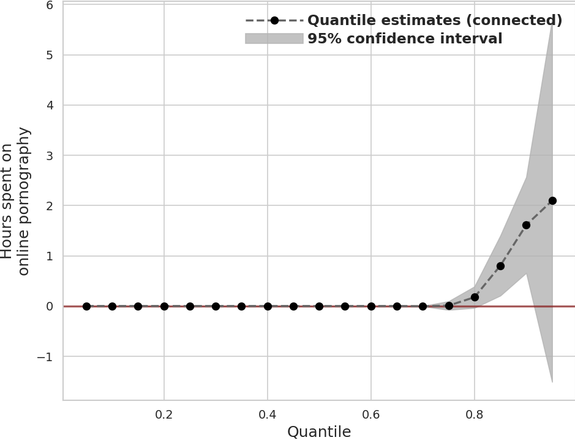
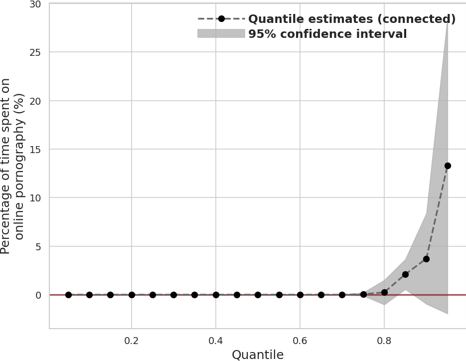

## Holier Than Thou? No Large Partisan Gaps in the Consumption of Pornography Online

Consumption of pornography has been blamed for a variety of societal ills, including the rise in misogyny, sex crimes, and the coarsening of the culture.
Using passively collected browsing data from YouGov, we investigate how much pornography Americans consume online.
We find that there is a sharp positive skew in the consumption of pornography, with a small number of users consuming lots of pornography and most consuming small amounts.
Only about 32 percent of respondents consumed pornography online during the month-long observation period.
Of the people who consumed pornography, the median consumer spent about three-quarters of an hour consuming pornography and 95 percent of the consumers spent less than five and a half hours.
Lastly, in line with previous research (MacInnis and Hodson, 2015; Edelman, 2009), which was based on aggregated data, we find that Republicans consume slightly more pornography online than Democrats.
Adjusting for immutable characteristics like age and gender makes the differences go away.

(Sood, Gaurav, and Lucas Shen. 2024. “Holier Than Thou? No Large Partisan Gaps in the Consumption of Pornography Online”. Journal of Quantitative Description: Digital Media 4 (April). https://doi.org/10.51685/jqd.2024.011.)

### Key Results

**Distribution of Partisan Differences in Hours Spent on Pornographic Sites**

**Distribution of Partisan Differences in Percentage of Time Spent on Pornographic Sites**

### Replication Materials
* [Data](https://dataverse.harvard.edu/dataset.xhtml?persistentId=doi:10.7910/DVN/VIV4TS)
* [Scripts](scripts/)
* [Tables](tabs/)
* [Figures](figs/)
* [Manuscript](ms/)

### Note

We measure pornographic content on domains using [piedomains](https://github.com/themains/piedomains) (and the YouGov-provided classifications).

### Authors

Lucas Shen and Gaurav Sood
